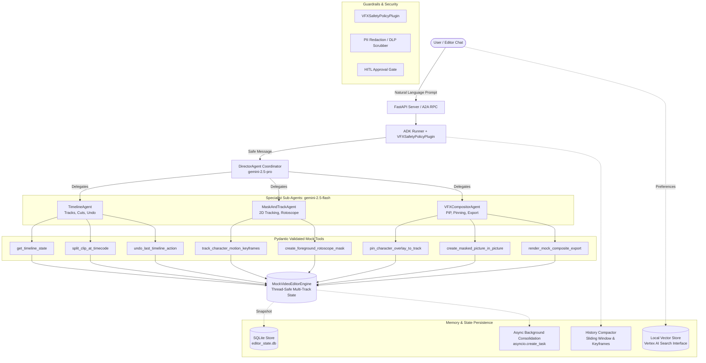

# AI Video Editor Assistant (`video-editor-assistant`)

> **Enterprise AI Multi-Agent Assistant for VFX & Video Editing with Google ADK, Strategic Model Routing, Context Compaction, OpenTelemetry Tracing, and Human-in-the-Loop Governance.**

[](https://github.com/vilotran/video-editor-assistant/actions/workflows/ci.yml)
[](https://www.python.org/downloads/release/python-3120/)
[](https://cloud.google.com/vertex-ai)
[](#multi-agent-orchestration--model-routing)

---

## Table of Contents
- [Executive Overview](#executive-overview)
- [System Architecture](#system-architecture)
- [Enterprise Production Architecture Matrix](#enterprise-production-architecture-matrix)
- [Mocked VFX & Video Editing Feature Suite](#mocked-vfx--video-editing-feature-suite)
- [Multi-Agent Orchestration & Model Routing](#multi-agent-orchestration--model-routing)
- [Context, Memory & Compaction Layer](#context-memory--compaction-layer)
- [Security, Guardrails & Human-in-the-Loop (HITL)](#security-guardrails--human-in-the-loop-hitl)
- [Observability, Auditing & PII Redaction](#observability-auditing--pii-redaction)
- [Local Setup & Testing Guide](#local-setup--testing-guide)
- [Infrastructure as Code (Terraform) & Deployment](#infrastructure-as-code-terraform--deployment)

---

## Executive Overview

Editing video and crafting visual effects (VFX) is often a tedious, multi-step process across timelines, keyframe vectors, rotoscope mattes, and compositing layers. 

The **AI Video Editor Assistant** is an enterprise-grade agent built on the **Google Agent Development Kit (ADK)**. It empowers editors to perform advanced editing actions via natural language conversation:
- Inspecting multi-track NLE timelines (V1, V2, V3) and executing sub-frame razor splits.
- Generating continuous 2D motion tracking keyframe trajectories for faces and moving subjects.
- Rotoscope alpha masking with adjustable edge feathering.
- Pinning motion graphics cutouts onto moving character coordinates.
- Creating Picture-in-Picture (PiP) composite windows with custom shapes (rounded rectangle, circle) and borders.
- Safe render export simulation governed by strict **Human-in-the-Loop (HITL)** approval tokens.

All video editing operations interface with a 100% thread-safe `MockVideoEditorEngine`, ensuring instant execution, zero heavy GPU rendering dependencies during development, and deterministic evaluation benchmarks.

---

## System Architecture



---

## Enterprise Production Architecture Matrix

This system implements 19 core production-grade capabilities across tool design, memory, orchestration, observability, and infrastructure:

| # | Architecture Capability | Category | Code Implementation | Verification / Test |
|---|-------------------------|----------|---------------------|----------------------|
| 1 | **Comprehensive Tool Docstrings** | Tool Design | All 7 tools in `app/tools/` include detailed Sphinx/Google docstrings with Args, Returns, and usage patterns. | `tests/unit/test_tools.py` |
| 2 | **Descriptive Naming** | Tool Design | Verb-noun naming convention: `track_character_motion_keyframes`, `create_masked_picture_in_picture`, etc. | `tests/unit/test_tools.py` |
| 3 | **Explicit JSON Schemas** | Tool Design | Strict Pydantic models with `extra="forbid"` in `app/models/schemas.py`. | `tests/unit/test_schemas.py` |
| 4 | **Guided Error Handling** | Tool Design | `ToolErrorResponse` returns structured `recovery_instructions` & `suggested_tool` instead of unhandled exceptions. | `tests/unit/test_tools.py`, `eval_007` |
| 5 | **Robust System Instructions** | Context & Memory | Operational Constitutions embedded in `app/agents/` defining personas, layer rules, and non-destructive standards. | `tests/integration/test_agent.py` |
| 6 | **History Compaction** | Context & Memory | `HistoryCompactor` in `app/memory/compaction.py` compresses keyframe arrays and sliding-window conversation turns. | `tests/unit/test_memory.py` |
| 7 | **Persistent Session State** | Context & Memory | `SQLiteSessionStore` in `app/memory/session_store.py` stores timeline snapshots, presets, and events. | `tests/unit/test_memory.py` |
| 8 | **Async Memory Operations** | Context & Memory | Non-blocking background worker `consolidate_session_memory_async` via `asyncio.create_task` in `app/memory/async_memory.py`. | `tests/unit/test_memory.py` |
| 9 | **Multi-Agent Patterns** | Orchestration | Coordinator `director_agent` orchestrates 3 specialist sub-agents (`timeline_agent`, `mask_agent`, `vfx_agent`). | `tests/integration/test_agent.py` |
| 10 | **Strategic Model Routing** | Orchestration | `gemini-2.5-pro` for complex director planning; `gemini-2.5-flash` for high-throughput sub-agent tool execution. | `tests/integration/test_agent.py` |
| 11 | **Guardrails & Policy Plugins** | Orchestration | `VFXSafetyPolicyPlugin` in `app/guardrails/policy_plugin.py` blocks injection, validates SMPTE timecodes, and enforces layer rules. | `tests/unit/test_guardrails.py` |
| 12 | **Human-in-the-Loop Hooks** | Orchestration | `HITLApprovalGate` in `app/guardrails/hitl.py` pauses `render_mock_composite_export` until user supplies approval token. | `tests/unit/test_guardrails.py`, `eval_006` |
| 13 | **Structured JSON Logging** | Observability | `structlog` + `python-json-logger` in `app/observability/logging.py` emitting standardized JSON logs. | `tests/unit/test_observability.py` |
| 14 | **Intent vs. Outcome Capture** | Observability | `IntentOutcomeAuditLogger` in `app/observability/intent_outcome.py` records INTENT and OUTCOME records with `duration_ms`. | `tests/eval/run_eval.py` |
| 15 | **Distributed Tracing** | Observability | OpenTelemetry `TracerProvider` and `trace_span` in `app/observability/tracing.py` linking query -> agent -> tool. | `tests/unit/test_observability.py` |
| 16 | **PII Redaction Pipeline** | Observability | `PIIRedactionPipeline` in `app/observability/pii_redaction.py` scrubbing emails, phones, API keys, and cards before logging/storage. | `tests/unit/test_observability.py` |
| 17 | **Automated Evaluation Suites** | CI/CD | Golden dataset (`tests/eval/datasets/eval_dataset.jsonl`), test harness (`tests/eval/run_eval.py`), and 36 unit tests. | `uv run pytest`, `uv run python tests/eval/run_eval.py` |
| 18 | **Infrastructure as Code** | CI/CD | Complete Terraform configuration in `terraform/` (`main.tf`, `variables.tf`, `outputs.tf`) provisioning Cloud Run & IAM. | `terraform/` directory |
| 19 | **Secure Secret Management** | CI/CD | `GCPSecretManagerClient` in `app/secrets/secret_manager.py` fetching credentials dynamically with zero hardcoded keys. | `app/secrets/secret_manager.py` |

---

## Mocked VFX & Video Editing Feature Suite

The agent exposes 7 specialized video editing tools across three sub-agents operating on `MockVideoEditorEngine`:

### 1. Timeline & Cut Sub-Agent (`timeline_agent`)
- `get_timeline_state(track_filter: Optional[List[str]]) -> Dict`:
  Returns active multi-track state (tracks V1, V2, V3, active clips, playhead position, and project FPS).
- `split_clip_at_timecode(track_id: str, clip_id: str, timecode: str) -> Dict`:
  Performs sub-frame razor split on the target clip at the specified SMPTE timecode (`HH:MM:SS:FF` or seconds).
- `undo_last_timeline_action() -> Dict`:
  Reverts the previous editing step using the engine's LIFO undo snapshot stack.

### 2. Motion Tracking & Masking Sub-Agent (`mask_and_track_agent`)
- `track_character_motion_keyframes(track_id: str, clip_id: str, target_label: str, start_timecode: str, end_timecode: str, sample_interval_frames: int = 1) -> Dict`:
  Computes frame-by-frame 2D transform motion tracking keyframe vectors `(frame, x, y, scale, rotation)` for moving faces or characters.
- `create_foreground_rotoscope_mask(track_id: str, clip_id: str, tracking_id: Optional[str], mask_shape: str = 'silhouette', feather_pixels: float = 2.0, invert: bool = False) -> Dict`:
  Generates an 8-bit RGBA alpha matte rotoscope mask isolating the foreground subject with edge feathering.

### 3. Compositing & Special Effects Sub-Agent (`vfx_compositor_agent`)
- `pin_character_overlay_to_track(target_track_id: str, overlay_asset_id: str, tracking_id: str, mask_id: Optional[str], blend_mode: str = 'normal', opacity: float = 1.0) -> Dict`:
  Pins graphic cutouts or props to an upper track driven by previously computed motion tracking trajectories.
- `create_masked_picture_in_picture(base_track_id: str, pip_track_id: str, pip_clip_id: str, position: str = 'top-right', normalized_x: float = 0.75, normalized_y: float = 0.75, scale: float = 0.28, mask_shape: str = 'rounded_rect', border_width: int = 4, border_color: str = '#FFFFFF') -> Dict`:
  Creates Picture-in-Picture windows with custom shapes, stroke borders, and layer hierarchy validation.
- `render_mock_composite_export(output_format: str = 'mp4', resolution: str = '1920x1080', fps: float = 24.0, render_preset: str = 'ProRes_422') -> Dict`:
  Simulates multi-track timeline rendering and final export. Governed by Human-in-the-Loop approval.

---

## Multi-Agent Orchestration & Model Routing

The system uses Google ADK multi-agent routing:
1. **Director Coordinator (`director_agent`)**:
   - Model: `gemini-2.5-pro` (optimized for complex multi-turn reasoning, task breakdown, and user communication).
   - Coordinates sub-agents and validates cross-agent dependencies.
2. **Specialist Sub-Agents (`timeline_agent`, `mask_and_track_agent`, `vfx_compositor_agent`)**:
   - Model: `gemini-2.5-flash` (optimized for rapid, cost-effective tool execution and low latency).

---

## Context, Memory & Compaction Layer

- **Persistent Session State**: `SQLiteSessionStore` persists timeline snapshots (`timeline_snapshots`), user VFX presets (`vfx_presets`), and conversation history (`conversation_events`) in `editor_state.db`.
- **Vector Knowledge Retrieval**: `LocalVectorStore` provides semantic search over NLE editing rules and VFX composition guidelines (with a Vertex AI Vector Search-compatible API).
- **History Compactor**: Compacts long conversational trajectories with sliding windows and condenses large 240+ frame keyframe arrays into concise mathematical bounds `[min..max]` to prevent LLM context exhaustion.
- **Async Consolidation**: `consolidate_session_memory_async` runs via non-blocking `asyncio.create_task` so UI response times remain sub-second.

---

## Security, Guardrails & Human-in-the-Loop (HITL)

- **Prompt Injection Defense**: `VFXSafetyPolicyPlugin` scans incoming user messages for jailbreaks or instructions overrides and neutralizes malicious inputs before execution.
- **SMPTE Syntax Guardrail**: Automatically validates timecode inputs to prevent malformed cuts.
- **Layer Hierarchy Verification**: Validates that upper composite tracks (e.g. V2, V3) are placed above base footage (V1).
- **HITL Confirmation Gate**: When `render_mock_composite_export` is called, `HITLApprovalGate` pauses execution and returns a structured challenge containing an `approval_token`. The export is executed only once human approval is confirmed via `/api/hitl/approve`.

---

## Observability, Auditing & PII Redaction

- **Structured JSON Logging**: Zero `print()` statements. Emits structured JSON events formatted with ISO 8601 timestamps, logger names, and log levels.
- **Intent vs. Outcome Auditing**: Every tool invocation logs an `INTENT` record with input arguments before execution, and an `OUTCOME` record with execution latency (`duration_ms`) and status metrics upon completion.
- **Distributed Tracing**: OpenTelemetry spans wrap every tool execution, exporting telemetry to Cloud Trace.
- **PII Redaction Pipeline**: Automatically detects and scrubs emails, phone numbers, Google API keys, credit cards, and SSNs from logs and state storage using regex filters and Google Cloud DLP.

---

## Local Setup & Testing Guide

### Prerequisites
- Python 3.12+
- `uv` package manager (`curl -LsSf https://astral.sh/uv/install.sh | sh`)

### Installation
```bash
git clone https://github.com/vilotran/video-editor-assistant.git
cd video-editor-assistant

# Install all dependencies with uv
uv sync --all-extras
```

### Running Unit & Integration Tests
```bash
# Run 36 unit and integration tests with pytest
uv run pytest -v tests/unit tests/integration/test_agent.py
```

### Running Lint Checks
```bash
# Verify code formatting and linting
uv run ruff check .
```

### Running the Golden Dataset Evaluation Benchmark
```bash
# Execute the automated evaluation harness against the 7 golden dataset scenarios
uv run python tests/eval/run_eval.py
```

### Starting the FastAPI Production Server
```bash
uv run python -m uvicorn app.fast_api_app:app --host 0.0.0.0 --port 8000
```
- Open Swagger Docs: `http://localhost:8000/docs`
- Health check: `http://localhost:8000/healthz`
- A2A Agent Card: `http://localhost:8000/a2a/app/.well-known/agent-card.json`

---

## Infrastructure as Code (Terraform) & Deployment

The `terraform/` directory provisions all Google Cloud Platform infrastructure for production deployment:
- **Cloud Run v2 Service**: Scalable serverless container hosting the FastAPI and ADK runtime.
- **Artifact Registry**: Docker container repository.
- **Secret Manager**: Secure API key storage with IAM role bindings.
- **Cloud Trace & Logging IAM**: Automated telemetry export bindings.

### Deploying with Terraform
```bash
cd terraform
terraform init
terraform plan -var="project_id=YOUR_PROJECT_ID"
terraform apply -var="project_id=YOUR_PROJECT_ID"
```

---

## License

This project is licensed under the Apache License, Version 2.0.
